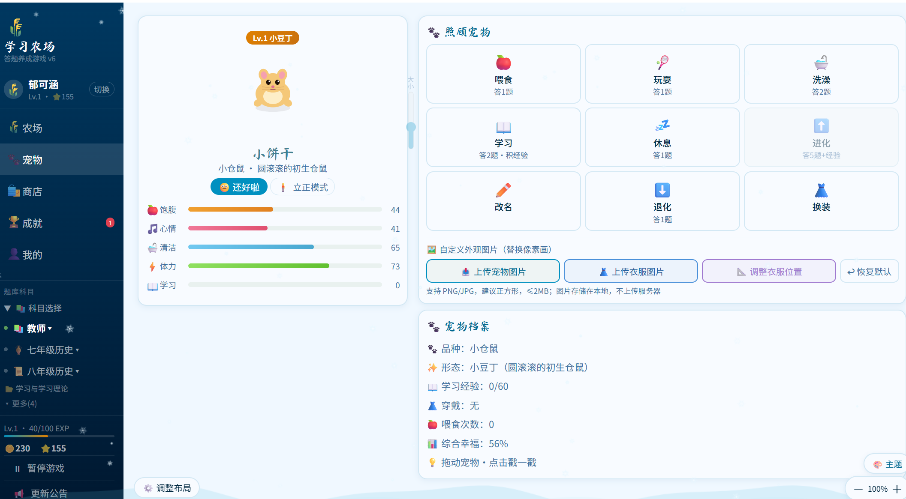

# 🌾 学习农场 Study Farm

> **把课堂积分变成一场养成游戏** — 学生种地、养宠物，教师轻松管理班级积分与排行。

[](https://cx3042672898-stack.github.io/Study-Farm/)
[](LICENSE)

---

## ✨ 这是什么

学习农场是一款**纯前端、无需服务器**的班级积分游戏系统，专为中学教师的考编与班级管理设计。

学生用积分（答题、背书、表现加分）来**种庄稼、养宠物、升级农场**；教师在同一界面下管理所有班级的积分记录与排行榜。不需要安装任何 App，打开网页即用。

---

## 🎮 学生端功能

| 功能 | 说明 |
|------|------|
| 🌱 农场种植 | 购买种子、播种浇水施肥，答题解锁操作 |
| 🐾 宠物养成 | 养小龙、仓鼠等宠物，随积分成长进化 |
| ⭐ 积分系统 | 由教师/课代表授予，可查看排行榜 |
| 🏆 成就系统 | 解锁各类成就徽章 |
| 📚 多科目答题 | 内置七八年级历史、地理等题库，反馈可更新新题库，包括教师考编题目！|
| ☁️ 云同步 | 支持 Firebase 跨设备同步存档 |

## 👨‍🏫 教师端功能

| 功能 | 说明 |
|------|------|
| 🏫 班级管理 | 创建班级、管理学生名单、设置课代表 |
| ⭐ 积分管理 | 批量/单人加减分，支持多种原因分类 |
| 📊 额外积分排行 | 按周期统计，支持当前/历史视图切换 |
| 🔄 周期重置 | 一键开启新周期，历史记录保留 |
| 📤 数据导出 | 导出班级名单、完整积分记录（CSV） |

---

## 🚀 快速开始

**方式一：直接在线使用**

👉 [https://cx3042672898-stack.github.io/Study-Farm/](https://cx3042672898-stack.github.io/Study-Farm/)

**方式二：本地运行**

```bash
git clone https://github.com/cx3042672898-stack/Study-Farm.git
# 直接用浏览器打开 index.html 即可，无需安装依赖
```

> ⚠️ 数据默认存储在**本地 localStorage**，不会上传任何服务器。开启云同步需要访问 Firebase（境外服务）。

---

## 🗂 项目结构

```
Study-Farm/
├── index.html              # 主界面入口
├── game.js                 # 核心游戏逻辑（农场、宠物、班级、积分）
├── gamedata.js             # 数据常量与存储工具
├── pet_config.js           # 宠物配置（种类、进化阶段、皮肤）
├── hamster_anim.js         # 仓鼠动画精灵
├── subjects.js             # 题库路由
├── subject_history7_mod.js # 七年级历史题库
├── subject_history8_mod.js # 八年级历史题库
├── subject_geo7_mod.js     # 七年级地理题库
├── subject_geo8_mod.js     # 八年级地理题库
├── subject_geoh_mod.js     # 地理综合题库
├── subject_english.js      # 英语题库
├── subject_teacher_mod.js  # 教师专属模块
├── firebase-config.js      # Firebase 云同步配置
├── firebase-bridge.js      # Firebase 通信桥接
└── update_log.js           # 更新日志
```

---

## 🛠 技术栈

- **纯原生 HTML / CSS / JavaScript**，零依赖、零构建
- 数据持久化：`localStorage` + `IndexedDB`（图片存储）
- 可选云同步：Firebase Realtime Database
- 支持 PWA 离线使用（手机端添加到主屏幕）

---

## 📸 界面预览


---

## 🤝 适用场景

- 中小学教师日常积分激励管理
- 班级竞赛排行（背书、测试、课堂表现）
- 学生自主使用农场养成作为学习动力

---

## 📄 开源协议

MIT License — 可自由使用、修改、部署，欢迎 PR 和 Issue。
